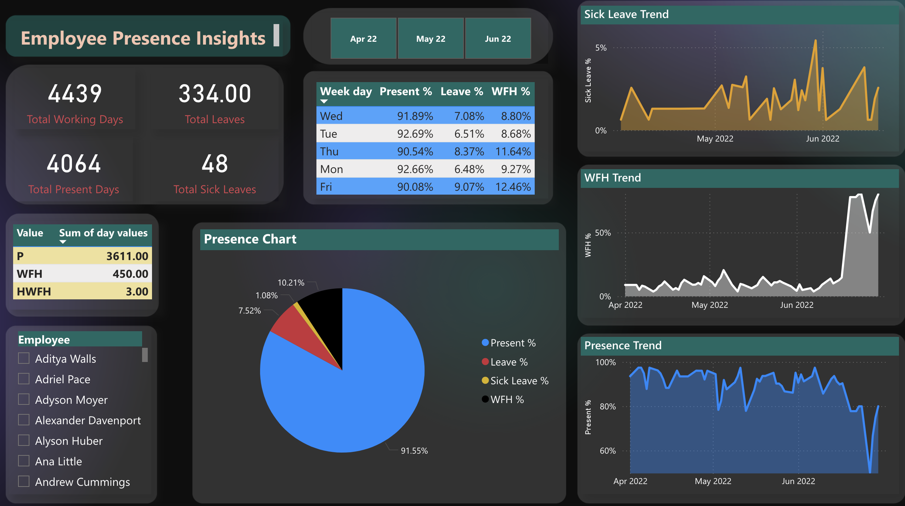

# Project: HR Analytics for Employee Presence Insights - AtliQ Hardware

## Table of Contents:
- Problem Statement
- Key Challenges and Solutions
- Data Transformation using Power Query
- Metrics Creation using DAX
- Key Insights
- Tools, Software, and Techniques
- References
  
## Problem Statement:
The HR department at AtliQ Hardware faced significant challenges in monitoring and managing employee attendance. Specifically, they needed a clear picture of employee preferences for working from home (WFH) versus the office, along with insights into the reasons behind these choices. Moreover, tracking sick leaves and understanding how often employees take leave were essential to improving workforce management and planning.

The problem was exacerbated by the fact that data was scattered across multiple Excel sheets, each representing different months and containing daily attendance data. To enable data-driven decision-making, the HR team required a centralized solution to gather, transform, and analyze this data efficiently.

## Key Challenges and Solutions:

### 1. Data Spread Across Multiple Excel Sheets:
Challenge: The data was fragmented, with each month stored in separate Excel workbooks. Every workbook used daily columns, which made consolidation difficult.
Solution: Using Power Query, I combined all the workbooks into a single unified dataset, ensuring consistent formatting across months.

### 2. Reformatting Data for Analysis:
Challenge: Each workbook contained individual columns for each date, which hindered proper time-series analysis.
Solution: I used advanced transformation techniques in Power Query to consolidate multiple date columns into one unified date column, allowing seamless analysis over time.

### 3. Advanced Data Transformation:
Challenge: The HR team needed dynamic, actionable insights from the data.
Solution: I utilized techniques such as pivoting data, managing parameters for multiple datasets, and invoking custom functions to automate and standardize the cleaning process.

### Data Transformation using Power Query:
The raw data from HR consisted of monthly attendance logs, with each workbook containing columns for various attendance statuses such as "Present," "Work From Home," "Sick Leave," and "Other Leave."

## Key Steps:

### Combining Multiple Excel Sheets:

Using Power Query's Append Queries feature, I merged multiple workbooks into one comprehensive dataset.
Consolidating Date Columns:

I transformed the daily columns into a single Date column using Unpivot Columns, creating a normalized structure that allowed further time-based analysis.
Handling Data Inconsistencies:

I ensured consistent formatting across datasets, cleaning errors and removing duplicates.
Automating Data Refresh:

Built a dynamic refresh mechanism in Power Query that allows easy updates as new monthly data is added, ensuring the system remains scalable.

## Metrics Creation using DAX:
Once the data was cleaned and consolidated, I built custom metrics using DAX (Data Analysis Expressions) to generate insights relevant to the HR team.

## Key Metrics:
- Employee Attendance Trend: Tracks daily and monthly presence trends across the workforce.
- Sick Leave Percentage: Measures the proportion of employees on sick leave for any given period.
- Work From Home (WFH) Analysis: Calculates WFH patterns and highlights preferences over time.
- Leave Analysis: Insights into the frequency and reasons for leave, broken down by department or team.

## DAX formulas:

- Leave % = `DIVIDE([Total Leaves],[Total Working Days],0)`

- Onsite Days = `[Total Present Days] - [WFH Days]`

- Present % = `DIVIDE([Total Present Days],[Total Working Days],0)`

- Sick Leave % = `DIVIDE([Total Sick Leaves],[Total Working Days],0)`

- Total Leaves = `CALCULATE(SUM('final data'[day values]), 'final data'[Value] in {"PL", "HPL", "SL", "HSL", "FFL", "HFFL", "BL", "LWP", "HLWP", "BRL", "HBRL","ML", "HML"})`

- Total Present Days =

`var pre = CALCULATE(SUM('final data'[day values]), 'final data'[Value]="P")`

`var wfh = CALCULATE(SUM('final data'[day values]), 'final data'[Value] in {"WFH", "HWFH"})`

`return pre + wfh`

- Total Sick Leaves = `CALCULATE(SUM('final data'[day values]), 'final data'[Value] in {"SL","HSL"})`

- Total Working Days =

`var totaldays = COUNT('final data'[Value])`

`var nonworkingdays = CALCULATE( COUNT('final data'[Value]), 'final data'[Value] in {"WO","HO"})`

`return totaldays-nonworkingdays`

- WFH % = `DIVIDE([WFH Days],[Total Working Days],0)`

- WFH Days = `CALCULATE(SUM('final data'[day values]), 'final data'[Value] in {"WFH", "HWFH"})`

## Key Insights:
The final dashboard provided actionable insights, including:

- Employee Attendance Heatmap: Visualized trends in employee presence across departments and months.
- WFH Trends: Highlighted a shift toward remote work preferences, which helped HR make decisions about flexible work arrangements.
- Sick Leave Patterns: Detected spikes in sick leaves, providing HR with data to potentially address wellness programs or adjust policies.
- Leave Frequency: Identified departments with higher leave rates, helping HR focus on engagement strategies.

| HR Employee Insights |
| ----------- |

  
## Tools, Software, and Techniques:
- Microsoft Excel: Source data stored across multiple Excel workbooks.
- Power Query: Used for data cleaning, transformation, and combining multiple sheets into a single dataset.
- Power BI: Visualization and dashboard creation using DAX to develop key metrics.
- DAX (Data Analysis Expressions): Used for creating custom metrics and calculations.

# References:
- Power Query Documentation: https://learn.microsoft.com/en-us/power-query/
- DAX Guide: https://dax.guide/
- https://blog.crossjoin.co.uk/2018/07/09/power-bi-combine-multiple-excel-worksheets/
